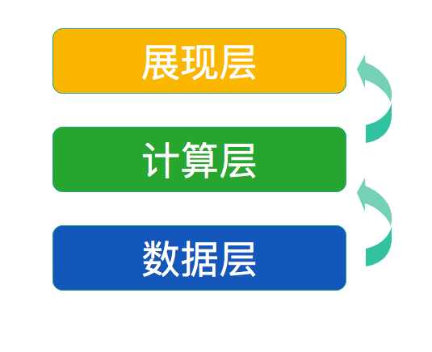
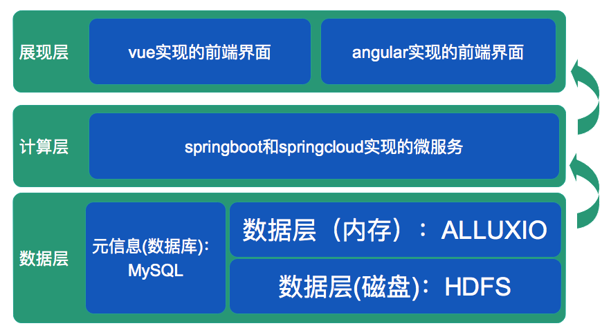
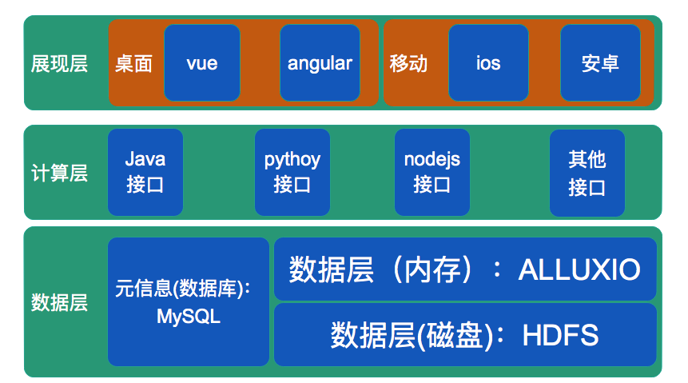
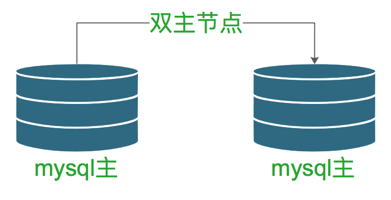
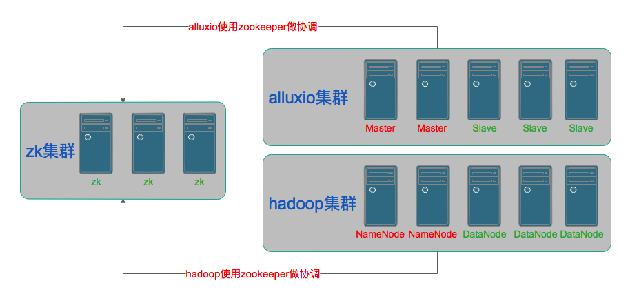

## 青橙科技教育系统设计思路  

------- 

### 一、整体设计部分  

#### 1.总体结构图  

 
```
系统共有三个层次
存储层：
   用于存储数据，包括Hadoop解决数据的永久存储问题
   MySQL解决元数据的永久存储问题
   alluxio解决数据的内存缓存问题
计算层：
   用于处理永久数据，永久元数据和缓存数据
展现层：
   用于解决桌面端，移动端的UI问题
```

#### 3.优先实现的部分  
 
```
1.存储层：
   数据永久存储可以考虑使用HDFS
   数据内存缓存可以考虑使用alluxio
   元数据永久存储可以考虑是用MySQL
2.计算层：
   程序开发框架可以考虑使用springboot进行快速开发
   程序运维可以考虑使用springcloud或docker方案
3.展现层
   桌面端：优先考虑使用vue2
   桌面端：可以考虑使用angular4
   移动端：暂时不实现   
```

#### 4.可以想象的部分  
 
```
整个架构要能容纳不同的新技术，为未来新的技术栈提供兼容性和扩展性。
```

------- 

### 二、存储层部分  

#### 1.存储层：元数据永久存储部分  
 
```
为高可用和负载考虑，必须采用mysql双主节点集群模式。
```
#### 2.存储层：数据永久存储和数据缓存部分  
 
```
1.集群协同：
  Hadoop和alluxio都依赖zookeeper做集群协调工作。可以考虑组件3-7台的zookeeper集群。
2.数据存储：
  主节点（namenode）：
     Hadoop2.x允许的namenode只能有两台，Hadoop3.x运行有多个namenode
  从节点（datanode）:
     用于存储实际的数据，根据存储数据大小可以灵活扩展。
3.数据缓存：
  alluxio这个分布式内存系统可以做为缓存使用。  
```


